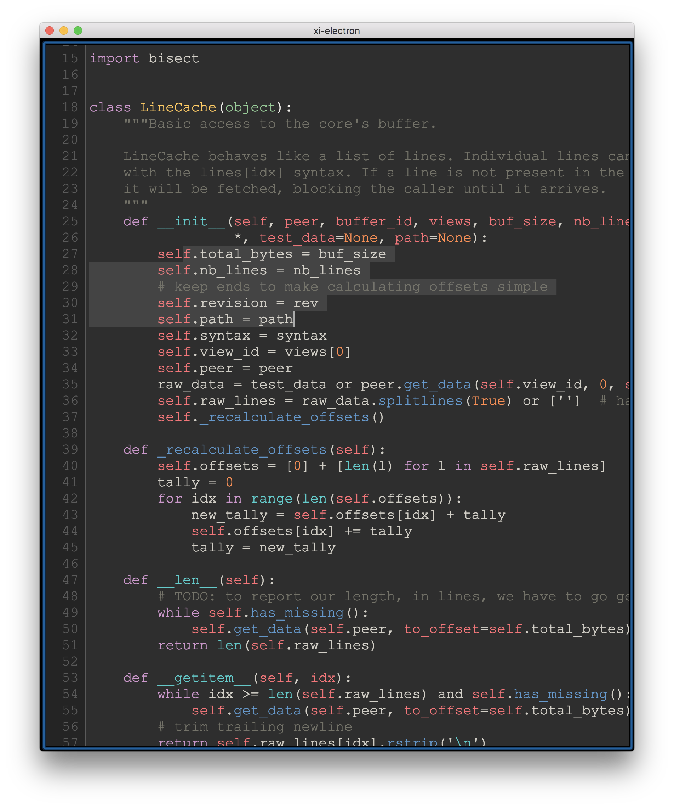

# Xi Electron

_A front-end for the xi-editor built with modern web technologies._

NOTE: This is still a WIP!

## Demo



## Goals of this Repo

* Make a front-end for [`xi-editor`](https://github.com/google/xi-editor) that is consistent across platforms
* Experiment with different editor rendering techniques on the web, specifically:
    - `2d` - `<canvas>`
    - `DOM` - direct use of the DOM (have a look at how [CodeMirror](http://marijnhaverbeke.nl/blog/a-pathological-scrolling-model.html) tackled some of the challenges of using the DOM)
    - `WebGL` - GPU accelerated rendering (via `<canvas>`)
* Hopefully create a functional mobile friendly version that is also fast and pleasant to use
    - once all three views are implemented we can benchmark them against each other

The main motivation for this repo is to experiment and profile the speeds and performance of different rendering techniques for text editors in the browser, specifically with modern HTML5 APIs and the like. The final goal would be a fully cross-platform (desktop+mobile) text editing experience, but that's still a long hope at this stage.

## Getting started

To build and run `xi-electron` you'll need to have [NodeJS](https://nodejs.org) installed (Node version 6 or greater) as well as `Git`.

To get started:

```bash
> git clone https://github.com/acheronfail/xi-electron
> cd xi-electron
> yarn          # or: npm install

# To build xi-electron into an application:
> yarn make     # or: npm run make

# If you just want to run in dev mode then run:
> yarn start    # or: npm run start
```

The `postinstall` script will attempt to build `xi-editor`, so you'll need Rust (see below for details).
The built app will be output to `xi-electron/out/`.

## Building `xi-core`

Keep in mind you'll need [Rust](https://www.rust-lang.org/) (version 1.20+ is recommended at the moment). On macOS platforms you'll need [Xcode 8.2](https://developer.apple.com/xcode/) and other relevant build tools.

This should automatically be done via `scripts/postinstall.js` once the node dependencies have been installed. You can re-run this script anytime you like. [`xi-editor`](https://github.com/google/xi-editor) is currently placed in this repository as a submodule, so we can have a "somewhat" stable experience. 

If you run into build issues ensure the submodule is present, ie:

```bash
> git submodule update --init
```

If you'd like to build and use a more recent version of `xi-editor` then just place it under `src/xi-core`. For building `xi-editor` manually [refer to its instructions](https://github.com/google/xi-editor#building-the-core).

## Contributing

Please! 🙏

## Credits

* All credits for the [xi-editor](https://github.com/google/xi-editor) go to Raph Levien.

## License

[MIT](LICENSE)

<!-- 

# TODO for `xi-electron`

- [ ] figure out how to build small xi-core/xi-syntect-plugin libs - currently they're quite large
- [ ] re-factor to be more platform portable (hopefully generate nice libs for non-electron platforms)
- [ ] implement WebGLView

-->
